# 移动互联网应用-垃圾分类APP构建

## **1.系统说明**

​	项目介绍：RC垃圾分类APP主要构建安卓客户端提供一个垃圾分类的知识库，通过建立网络终端服务，对接线上数据库，实现网络连通，为用户提供一个便捷的垃圾分类解决方案。此外 ，还构建了一套基础的后台管理系统架构，用于管理维护垃圾分类相关信息并为安卓客户端提供接口服务，构建一套相对完善的交互机制。

### **a.系统架构说明**

​	项目设计主要包括RC安卓APP和RC后台服务两部分组成，对应系统架构和业务架构简单说明如下所示

<center>业务架构图</center>

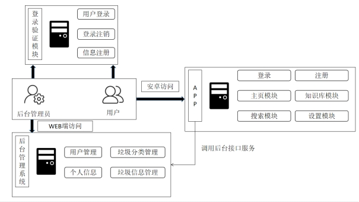

<center>系统架构图</center>

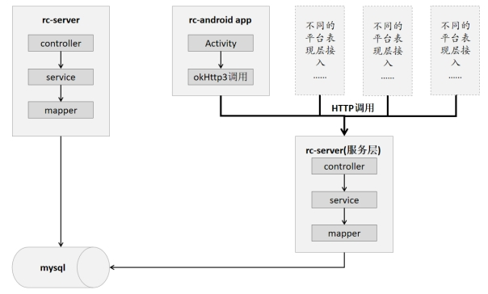

### **b.核心技术栈分析**

#### **活动Activity**

​	Activity是Android的四大组件之一。是用户操作的可视化界面；它为用户提供了一个完成操作指令的窗口。当创建完毕Activity之后，需要调用setContentView()方法来完成界面的显示；以此来为用户提供交互的入口。

一个Activity实质上有四种状态：

​	运行中(Running/Active):这时Activity位于栈顶，是可见的，并且可以用户交互。

暂停(Paused):当Activity失去焦点，不能跟用户交互了，但依然可见，就处于暂停状态。当一个新的非全屏的Activity或者一个透明的Activity放置在栈顶，Activity就处于暂停状态；这个时候Activity的各种数据还被保持着；只有在系统内存在极低的状态下，系统才会自动的去销毁Activity。

​	停止(Stoped):当一个Activity被另一个Activity完全覆盖，或者点击HOME键退入了后台，这时候Activity处于停止状态。这里有些是跟暂停状态相似的：这个时候Activity的各种数据还被保持着；当系统的别的地方需要用到内容时，系统会自动的去销毁Activity。

​	销毁(Detroyed):当我们点击返回键或者系统在内存不够用的情况下就会把Activity从栈里移除销毁，被系统回收，这时候，Activity处于销毁状态。

​	下图是从官网摘录的Activity在各个状态下回调用的回调方法：

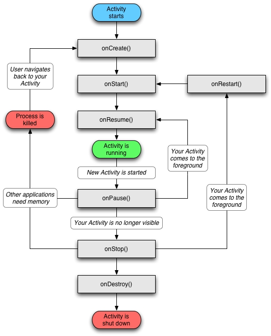

<center>图-Activity状态图</center>

#### 用户界面开发

​	通过Android提供的组件，自定义构建用户界面设计，开发安卓客户端（目前界面设计还是基于原生自定义的排版，后续可考虑引入一些UI组件进一步美化界面设计）

​	在后台管理系统中则是借助Vue+ElementUI的组合构建后台系统的界面设计

#### **碎片开发**

碎片是一种镶嵌在活动中的UI片段。可以用多个碎片来充满整个活动。此处借助Fragment构建APP主页的基本组成（将APP主页进行UI拆分，构建多个Fragment组成一个MainActivity，后续APP构建说明中会对相关内容作分析，此处简单介绍技术栈应用）

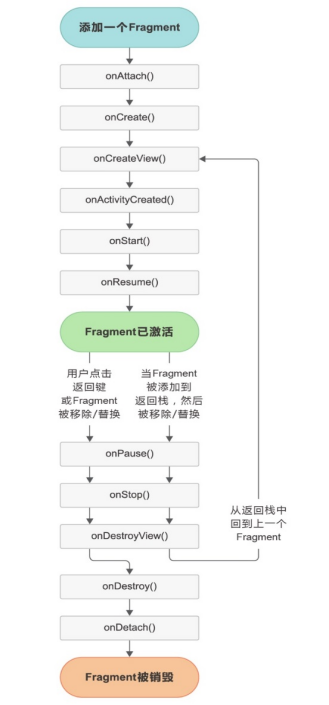 

#### **广播机制**

​	除却检测网络变化、时间变化与开机启动的场景应用，广播机制还有其他场景的应用，例如可以通过静态/动态注册广播接受者、自定义发送广播等实现消息通知。静态注册可包括监听系统启动广播、短信服务监听、管理员权限获取（注册设备管理器概念）等；动态注册广播接收者则可监听事件变化，当有变化则返回给服务（服务通过返回Bind或者写SharePrecefence等方法传出数据），其主要场景可包括电话监听（监听来电去电 、例如 黑名单、归属地查询等）、程序加锁（监听当前栈顶程序是否被加锁）、实时定位 （不断读取当前定位信息、锁屏事件） 、锁屏事件（监听到锁屏后可以做一些清理工作）、和桌面上的Widget通信等场景应用

​	目前APP中基本的消息通知由相应的监听事件进行触发，待后续引入“定位”或者“附近垃圾点”功能，可考虑借助广播机制实现实时定位。（此外可通过监听锁屏事件，相应触发一些资源清理的动作）

#### **持久化存储与共享**

​	SQLite在安卓应用开发中有着广泛的应用，它是一款轻量级的关系型数据库，它的运算速度非常快，占用资源很少，通常只需要几百KB的内存就足够了，因而特别适合在移动设备上使用。通过查阅资料可以了解到，除却SQLite数据库，Mysql等关系型数据库等也可作为一个数据持久化存储的容器，参考网络的一些学习资源和应用，尝试借助Mysql构建数据存储。此外针对文件交互可借助Android系统提供的方式实现相关的数据持久化功能（文件存储、SharedPreferences存储以及数据库存储）。

​	数据库存储：可通过SQLite或者其他关系型数据库存储数据，此处应用的是mysql数据库进行持久层数据交互，APP客户端可通过直连Mysql数据库或者借助okhttp3调用RC后台服务接口进行数据交互和响应。

#### **网络技术**

​	此处网络技术的应用主要是通过数据持久化存储这一块体现，安卓客户端连接后台数据库可有两种实现方式，一种是通过直连Mysql的概念访问（安卓模拟机则是直接访问宿主机的Mysql数据库或者是连接云服务的数据库），一种则是通过中转服务的概念以访问接口的方式进行数据交互，即调用后台接口服务进行数据交互。

#### **后台服务**

​	结合上述说明，此处通过构建后台管理系统，提供数据信息相关维护功能并为安卓客户端提供服务接口调用支撑。

​	后台服务的构建依托于WEB应用开发，此处采用Springboot+VUE+MyBatis-Plus的组合构建后台基本应用的功能。

## 2. **APP构建说明**

APP控件应用说明：

| 控件                 | 功能                                                         |
| -------------------- | ------------------------------------------------------------ |
| TextView             | 用于在界面上显示一段文本信息                                 |
| Button               | 用于和用户进行交互的重要控件                                 |
| EditText             | 用于和用户进行交互的重要控件，它允许用户在控件里输入和编辑内容，并可以在程序中对这些内容进行处理。 |
| ImageView            | 用于在界面上展示图片                                         |
| AlertDialog          | 在当前界面弹出一个对话框，这个对话框是置顶于所有界面元素之上的，能够屏蔽其他控件的交互能力，因此AlertDialog一般用于提示一些非常重要的内容或者警告信息 |
| ListView             | 以列表的形式根据数据的长自适应展示具体内容                   |
| SearchView           | Android原生的搜索框控件,它提供了一个用户界面,可以让用户在文本框内输入文字,并允许通过看监听器监控用户输入 |
| HorizontalScrollView | 用于为普通组件添加滚动条的组件                               |
|                      |                                                              |

 

### a. **欢迎页构建**

#### **构建说明**

欢迎页构建主要实现思路为APP启动主Activity的设置，设置定时器从一个页面跳转到另一个页面，构建思路说明如下：

<1>定义一个WelcomeActivity，设定相应的定时器和组件注册

<2>定义activity_welcome.xml，设定UI布局

<3>在AndroidManifest.xml进行配置，将其设定为打开app默认显示的activity

 

> WelcomeActivity定义

定义一个WelcomeActivity，设定相应的定时器和组件注册

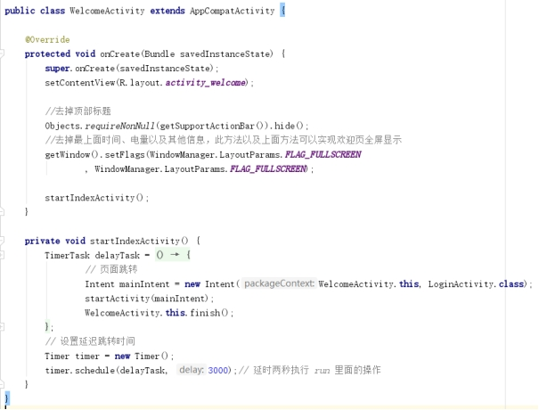 

> Layout布局定义：activity_welcome.xml

定义activity_welcome.xml，设定UI布局

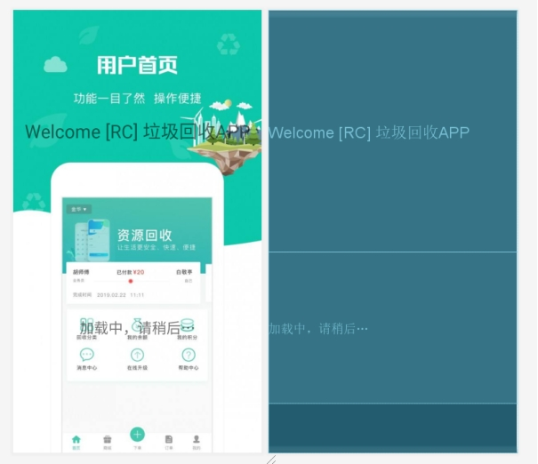 

> AndroidManifest注册

​	在AndroidManifest.xml进行配置，将其设定为打开app默认显示的activity

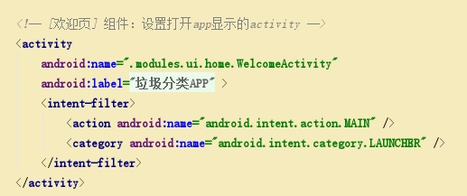 

 

### b. **登录模块构建（登录注册）**

#### **构建说明**

​	登录注册构建说明如下所示：由于APP功能模块开发涉及的构建思路基本大同小异，此处不对代码做冗余的介绍，而是通过对设计思路和核心技术栈的应用进行扩展说明

<1>定义一个WelcomeActivity，设定相应的定时器和组件注册

<2>定义activity_welcome.xml，设定UI布局

<3>在AndroidManifest.xml进行配置，将其设定为打开app默认显示的activity

 

> LoginActivity、RegisterActivity活动定义

​	定义LoginActivity、RegisterActivity，设定相应的组件注册和监听

​	在LoginActivity中引入自定义的SharedPreferencesUtil工具类对登录用户信息进行管理，当调用http服务接口响应成功之后便可获取反馈的用户信息，随后借助该工具类存储登录用户信息，以供各个Activity中进行引用

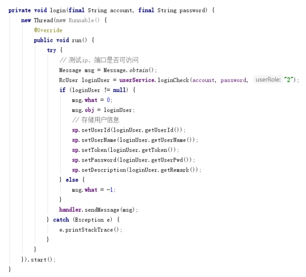 

​	RegisterActivity中处理用户注册信息，校验通过之后调用http服务完成信息注册，随后跳转到登录页面进入下一步的操作

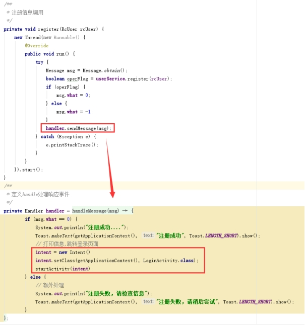 

 

> layout布局定义：activity_login.xml、activity_register.xml

​	定义activity_login.xml、activity_register.xml，设定UI布局

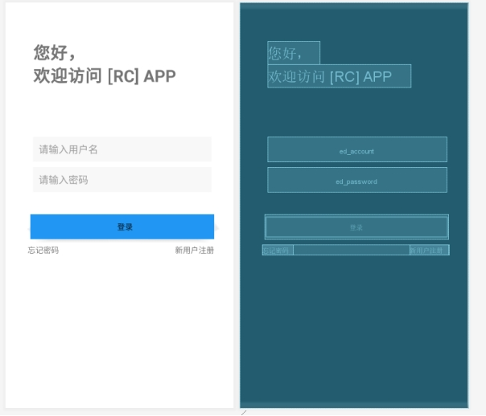 

 

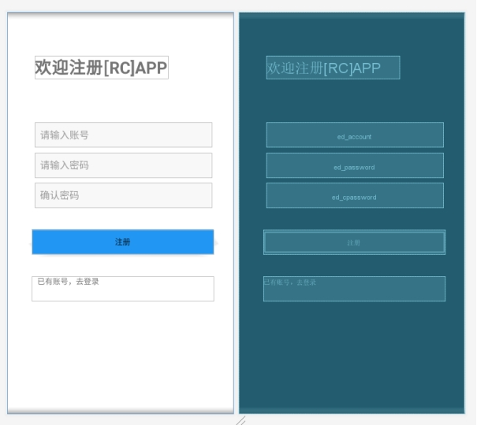 

 

> AndroidManifest注册

​	在AndroidManifest.xml进行配置，分别定义登录、注册组件

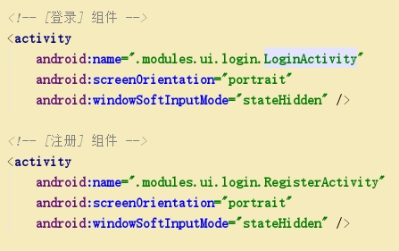 

### c. **主界面构建**

​	在平时的Android开发中，经常会使用Tab来进行主界面的布局。由于手机屏幕尺寸的限制，合理使用Tab可以极大的利用屏幕资源，给用户带来良好的体验。此处主要借助ViewPager + Fragment构建APP主页设计（基本布局构建、组件引入）。

​	ViewPager + Fragment的组合考虑是基于单纯使用ViewPager的方式可以实现左右滑动切换页面和点击Tab切换页面的效果。但是这种方式需要在Activity完成所有的代码实现，包括初始化Tab及其对应页面的初始化控件、数据、事件及业务逻辑的处理。这样会使得Activity看起来非常臃肿，进而造成代码的可读性和可维护性变得极差。而Fragment是一种可以嵌入在Activity当中的UI片段，它能让程序更加合理和充分地利用大屏幕的空间，因而在平板上应用得非常广泛。可以分别使用Fragment来管理每个Tab对应的页面的布局及功能的实现。然后将Fragment与Android关联，这样Android只需要管理Fragment就行了，起到了调度器的作用，不再关心每个Fragment里的内容及功能实现是什么。这样就极大的解放了Activity，使代码变得简单、易读。

#### **构建说明**

具体主页面构建说明如下

<1>主页面Activity、绑定Fragment构建

<2>layout布局定义：activity_home_main主视图、关联Fragment视图绑定

<3>AndroidManifest注册

 

​	定义MainActivity和对应的Fragment组成（此处分别谁定IndexFragment、RepoFragment、SearchFragment、SettingFragment分别对应首页、知识库、搜索列表、设置四个tab页），并为其设定相应的组件注册和监听

​	MainActivity中绑定activity_home_main视图，主要定义四个Fragment相关的引用和布局，通过在onCreate方法中初始化各个Fragment控件、相关事件监听（Tab图标点击事件监听以及ViewPager的页面滑动事件监听进而切换tab）等内容

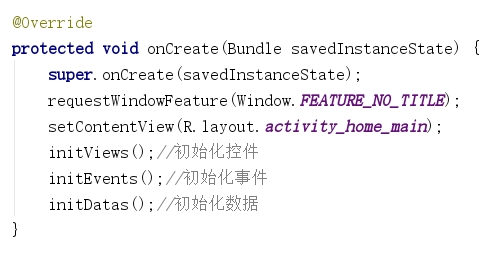 

​	Fragment定义：（此处参考SearchFragment 中的定义简单介绍Fragment的引入，每个Fragment中相关功能的实现和Activity中的应用基本上是差不多的）

```java
public class SearchFragment extends Fragment {
@Nullable
@Override
public View onCreateView(LayoutInflater inflater, @Nullable ViewGroup container, @Nullable Bundle savedInstanceState) {
    View view = inflater.inflate(R.layout.home_tab_search, container, false);
   return view;
}
```


> layout布局定义：activity_home_main主视图、关联Fragment视图绑定

​	定义activity_home_main.xml，设定首页的主页面UI布局，而其关联的Fragment组合的layout则分别对应home_tab_index.xml、home_tab_repo.xml、home_tab_search.xml、home_tab_setting.xml文件

1)activity_home_main.xml构成：

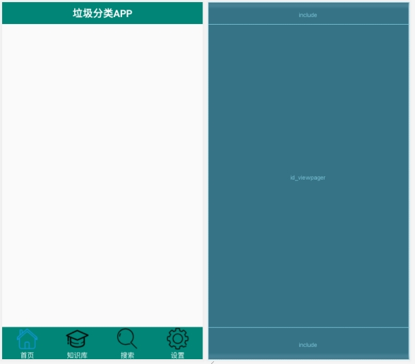 

 

2)home_tab_index.xml构成：

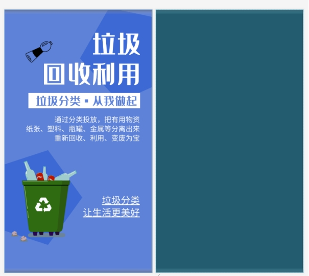 

 

3)home_tab_repo.xml构成：

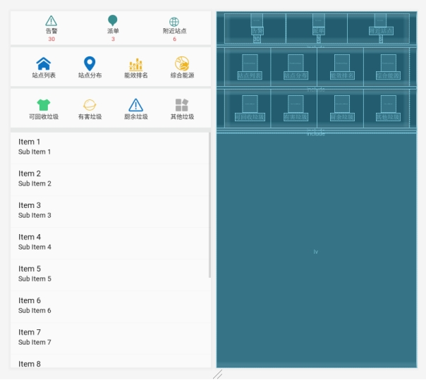 

 

4)home_tab_search.xml构成：

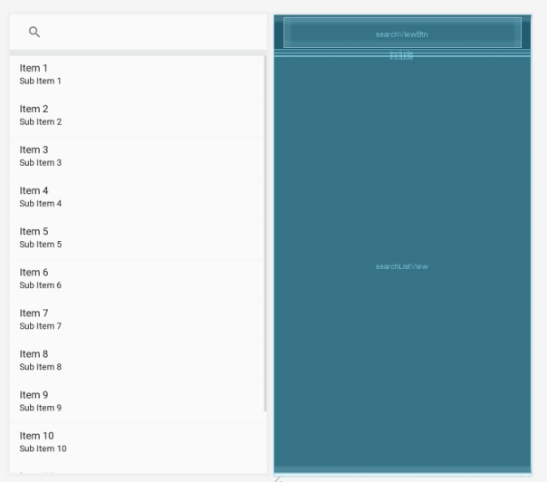 

 

5)home_tab_setting.xml构成：

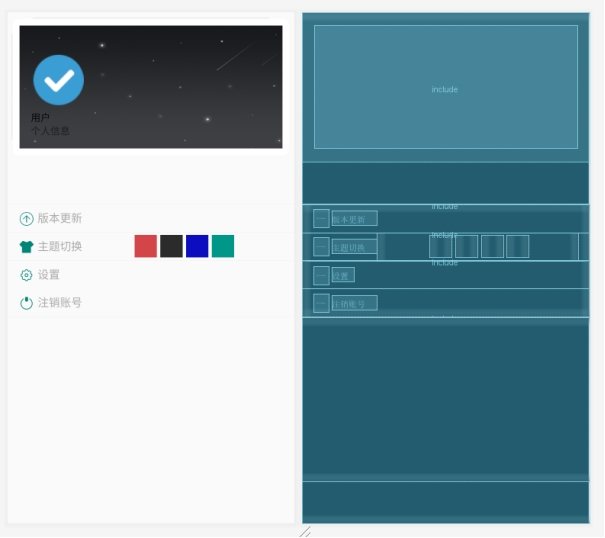 

 

> AndroidManifest注册

​	在AndroidManifest.xml进行配置，定义首页组件

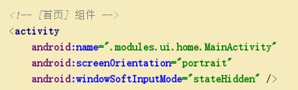 

 

### **d.核心设计功能说明**

​	基于上述内容，可以看到APP的基本雏形构建基本完成，后续则依据不同的技术栈、结合相应的功能模块进行业务逻辑开发（即实现相应的功能模块、打通后台接口访问服务），此处针对除却基本的组件应用此处不作概述，此处结合ListView组件应用、动态标签生成、持久化存储、后台服务四个点简单叙述相应的开发流程和核心知识点

#### **<1>ListView组件应用**

​	ListView组件应用即类似于手机自带的通讯录列表、音乐APP的歌手列表、外卖APP的分类菜单，可用于列表数据的个性化展示，在项目中通过搜索列表的形式将相应的垃圾信息做了一个展示。此处针对知识库中的列表设置进行分析，主要涉及文件有RepoFragment、home_tab_repo.xml

其主要设计思路说明如下：

<1>在layout/home_tab_repo.xml中定义一个ListView组件

<2>自定义RubbishInfoAdapter适配器，待调用http服务接收到数据列表后动态刷新UI组件

<3>在RepoFragment中注册组件，绑定监听事件响应列表刷新

> home_tab_repo.xml

对应layout文件中定义一个ListView组件

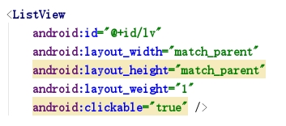 

> RubbishInfoAdapter

​	RubbishInfoAdapter主要提供一个构造函数用于适配相应的数据和视图，并重载getView方法重新加载布局，此处数据则是针对Rubbish集合（垃圾信息），而布局则是针对ListView组件以及每个子项的引入

```java
/**
 * 自定义RubbishInfoAdapter
 */
public class RubbishInfoAdapter extends ArrayAdapter<Rubbish> {
    private int resourceId;

    // 适配器的构造函数，把要适配的数据传入这里
    public RubbishInfoAdapter(Context context, int textViewResourceId, List<Rubbish> objects) {
        super(context, textViewResourceId, objects);
        resourceId = textViewResourceId;
    }

    // convertView 参数用于将之前加载好的布局进行缓存
    @Override
    public View getView(int position, View convertView, ViewGroup parent) {
        Rubbish rubbish = getItem(position); //获取当前项的实例

        // 加个判断，以免ListView每次滚动时都要重新加载布局，以提高运行效率
        View view;
        ViewHolder viewHolder;
        if (convertView == null) {

            // 避免ListView每次滚动时都要重新加载布局，以提高运行效率
            view = LayoutInflater.from(getContext()).inflate(resourceId, parent, false);

            // 避免每次调用getView()时都要重新获取控件实例
            viewHolder = new ViewHolder();
            viewHolder.rubbishImage = view.findViewById(R.id.rubbish_image);
            viewHolder.rubbishName = view.findViewById(R.id.rubbish_name);

            // 将ViewHolder存储在View中（即将控件的实例存储在其中）
            view.setTag(viewHolder);
        } else {
            view = convertView;
            viewHolder = (ViewHolder) view.getTag();
        }

        // 获取控件实例，并调用set...方法使其显示出来
        viewHolder.rubbishImage.setImageResource(rubbish.getImageId());
        viewHolder.rubbishName.setText(rubbish.getRubbishName());
        return view;
    }

    // 定义一个内部类，用于对控件的实例进行缓存
    class ViewHolder {
        ImageView rubbishImage;
        TextView rubbishName;
    }
}
```

 

> RepoFragment

​	在RepoFragment对ListView进行组件注册并添加相应的监听事件，通过按钮点击事件触发列表刷新，在调用http服务获取到列表信息之后则可借助自定义适配器对UI组件进行刷新

```java
// 参数分别对应当前context域，对应刷新组件所在layout文件，调用http服务获取的垃圾信息集合
RubbishInfoAdapter adapter = new RubbishInfoAdapter(getContext(), R.layout.repo_rubbish_item, rubbishList);
// 将适配器上的数据传递给listView
mlv.setAdapter(adapter);
```

​	此外，还可对列表子项添加监听事件，此处针对每个子项添加相应的监听事件，点击后触发对话框的弹出，显示垃圾信息的详情

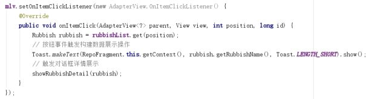 

​	对话框实现参考如下所示

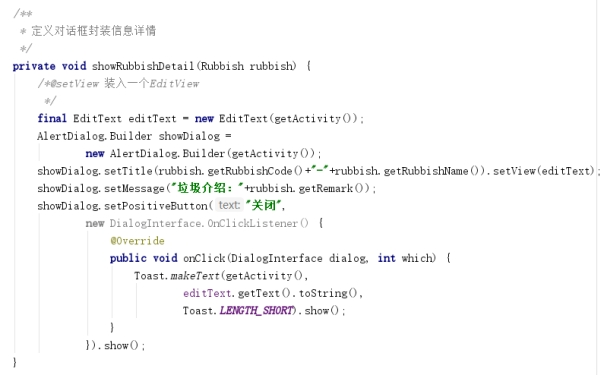 

 

#### **<2>动态标签生成**

​	动态标签的应用场景主要是针对一些热门搜索词等相关概念进行扩展，此处针对搜索引入动态标签的概念，给用户提供热门词汇便捷查询的入口。此处简单说明安卓客户端构建动态标签的实现思路（具体动态标签的数据源则需要依托于后台数据库的一些统计分析场景，此处为了简单展示，暂定一组静态数据进行填充，后续可结合实际的应用场景进行相应的扩展）

<1>layout下构建一个默认的TextView，并关联定义其相应的drawable相关标签的样式信息，此处涉及文件：search_mark_beselected.xml、search_mark_notbeselected.xml、search_mark_select.xml

​	可以理解成这个默认的组件是作为后续UI复制的依据，动态生成的标签根据此定义进行构建，随后动态加载到指定的区域中

<2>在对应的layout文件下定义一个滚动条用于装载标签组件，此处相应在home_tab_search.xml下定义一个组件展示区域

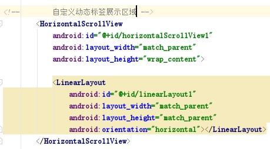 

<3>在SearchFragment下构建标签视图，动态加载数据、添加标签监听事件

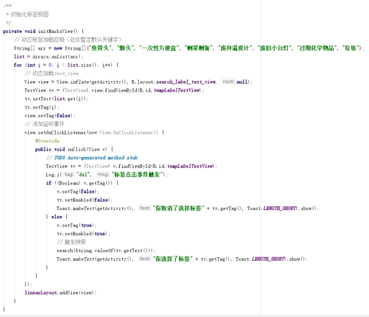 

 

 

构建完成，则可相应勾勒基本的动态标签展示如下所示

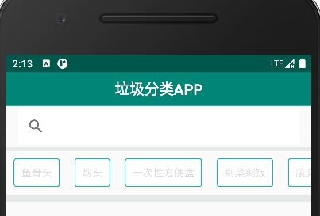 

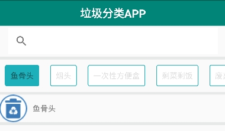 

 

 

#### **<3>持久化存储**

> SharedPreferences存储

​	SharedPreferences存储：借助SharedPreferences构建用户登录状态和信息存储，并自定义SharedPreferencesUtil工具类，提供相应的方法供外部调用。基于这种场景应用，可以借助SharedPreferences实现不同Activity或者Fragment之间的数据传递、共享引用

```java
public class SharedPreferencesUtil {

    public static final String TAG = "SharedPreferencesUtil";
    private static final String USER_TOKEN = "USER_TOKEN";
    private static final String USER_ID = "USER_ID";
    private static final String USER_NAME = "USER_NAME";
    private static final String PASSWORD = "PASSWORD";
    private static final String Description = "Description";


    private static SharedPreferences mPreferences;
    private static SharedPreferences.Editor mEditor;
    private static SharedPreferencesUtil mSharedPreferencesUtil;
    private final Context context;

    public SharedPreferencesUtil(Context context) {

        this.context = context.getApplicationContext();
        mPreferences =   this.context.getSharedPreferences(TAG, Context.MODE_PRIVATE);
        mEditor = mPreferences.edit();
    }

    public static SharedPreferencesUtil getInstance(Context context) {
        if (mSharedPreferencesUtil ==null){
            mSharedPreferencesUtil =new SharedPreferencesUtil(context);
        }
        return  mSharedPreferencesUtil;
    }

    public void put(String key, String value) {
        mEditor.putString(key,value);
        mEditor.commit();
    }

    public void putBoolean(String key, boolean value) {
        mEditor.putBoolean(key,value);
        mEditor.commit();
    }

    public String get(String key) {
        return mPreferences.getString(key,"");
    }

    public boolean getBoolean(String key, boolean defaultValue) {
        return mPreferences.getBoolean(key,defaultValue);
    }

    public void removeSP(String key) {
        mEditor.remove(key);
        mEditor.commit();
    }

    // 自用方法
    public  void setToken(String token) {
        put(USER_TOKEN,token);
    }
    public String getToken() {
        return get(USER_TOKEN);
    }

    public void setUserId(String userId) {
        put(USER_ID,userId);
    }
    public String getUserId() {
        return get(USER_ID);
    }

    public  void setUserName(String userName) {
        put(USER_NAME,userName);
    }
    public String getUserName() {
        return get(USER_NAME);
    }

    public  void setPassword(String password) {
        put(PASSWORD,password);
    }
    public String getPassword() {
        return get(PASSWORD);
    }

    public String getDescription() {return get(Description);}
    public void setDescription(String description) {put(Description,description);}


    public boolean isLogin() {

        return !TextUtils.isEmpty(get(USER_TOKEN))&&!TextUtils.isEmpty(get(USER_NAME))
                &&!TextUtils.isEmpty(get(PASSWORD));
    }

    public void logout() {
        put(USER_TOKEN,"");
        put(USER_ID,"");
        put(USER_NAME,"");
        put(PASSWORD,"");
        put(Description,"");
    }
}
```

 

> 数据库存储

​	数据库存储采用的是mysql数据库，通过后台接口服务操作相应的数据库内容，具体调用参考后续后台服务说明，此处介绍数据库信息的基本设计

<center>rc_user表：用户信息表</center>

| 列名          | 数据类型    | 约束        | 描述                                        |
| ------------- | ----------- | ----------- | ------------------------------------------- |
| user_id       | varchar(50) | PRIMARY KEY | 用户ID                                      |
| user_account  | varchar(50) | not null    | 账号                                        |
| user_name     | varchar(50) | not null    | 账号名称                                    |
| user_password | varchar(50) | not null    | 密码                                        |
| user_role     | varchar(10) | not null    | 用户类型 1-管理员；2-普通用户               |
| user_status   | varchar(10) | not null    | 用户状态标识 0-禁用；1-正常                 |
| extend_prop   | varchar(50) | -           | 扩展属性 可结合系统需求设定冗余字段扩展属性 |
|               |             |             |                                             |

 

<center>rc_classify：垃圾分类表</center>

| 列名            | 数据类型      | 约束             | 描述                              |
| --------------- | ------------- | ---------------- | --------------------------------- |
| classify_id     | varchar(50)   | PRIMARY KEY      | 垃圾分类ID                        |
| classify_code   | varchar(50)   | not null、unique | 垃圾分类编号                      |
| classify_name   | varchar(50)   | not null         | 垃圾分类名称                      |
| remark          | varchar(2000) | not null         | 备注                              |
| oper_permission | varchar(10)   | not null         | 数据操作类型 0-禁止操作；1-可操作 |
| create_time     | datetime      | -                | 创建时间                          |
| modify_time     | datetime      | -                | 修改时间                          |
|                 |               |                  |                                   |

 

<center>rc_rubbish：垃圾信息表</center>

| 列名         | 数据类型      | 约束             | 描述             |
| ------------ | ------------- | ---------------- | ---------------- |
| rubbish_id   | varchar(50)   | PRIMARY KEY      | 垃圾分类ID       |
| rubbish_code | varchar(50)   | not null、unique | 垃圾分类编号     |
| rubbish_name | varchar(50)   | not null         | 垃圾分类名称     |
| classify_id  | varchar(50)   | not null         | fk-归属分类ID    |
| remark       | varchar(2000) | not null         | 备注             |
| rubbish_pic  | varchar(200)  | not null         | 关联图片路径信息 |
| create_time  | datetime      | -                | 创建时间         |
| modify_time  | datetime      | -                | 修改时间         |
|              |               |                  |                  |

 

#### **<4>后台服务**

​	项目中后台服务的应用依托与rc-server后台系统的构建以及okhttp3的应用，此处主要从客户端的应用层介绍网络服务和后台接口调用相关概念

​	安卓客户端如果需要调用外部api则相应需要添加网络访问权限，可在AndroidManifest.xml文件中进行定义

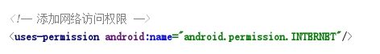 

​	开通网络访问权限之后，项目中涉及mysql数据库的访问主要有两种方式，一种是通过直连的方式构建连接（直接连接宿主机或者云服务的mysql服务），一种则是通过后台服务接口的概念调用服务间接访问数据库。项目一开始设计采用的是通过JDBC相关服务操作直接和宿主机的mysql构建联系，但基于这种模式下涉及到的框架引用和封装没有办法直接引用，只能通过传统的JDBC进行访问控制（可能和安卓内部的一些机制和限制相关，还没有得到有效解决，此外，考虑数据访问的安全性和系统框架设计的完整性采取通过okhttp3的方式调用后台服务访问接口）

​	后台接口服务的构建参考下文RC-后台服务构建说明，此处描述安卓客户端如何访问服务进行扩展，以最基础的登录接口进行说明。

> 业务逻辑定义

​	定义UserService、UserServiceImpl封装业务操作逻辑，调用后台服务并处理响应结果

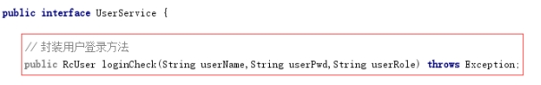 

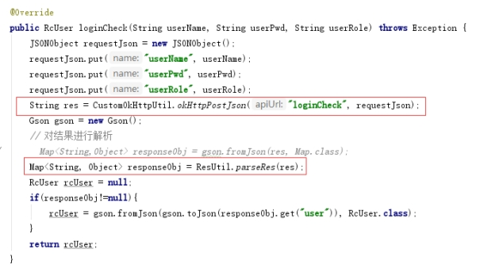 

​	此处涉及到两个自定义工具类，分别为CustomOkHttpUtil.java、ResUtil.java分别对应接口调用工具类、结果响应处理工具类。通过CustomOkHttpUtil传入指定的接口url、请求参数则可调用到指定的后台服务接口，随后再调用ResUtil工具类方法解析并处理参数信息


> Activity调用服务

​	由于对于网络状况的不可预见性，很有可能在网络访问的时候造成阻塞，安卓版本升级后不允许在主线程直接访问网络（默认的情况下如果直接在主线程中访问就报出NetworkOnMainThreadException异常），参考网络资源可有多种解决方式，此处项目采用的是通过创建独立线程的方式调用。

​	具体思路说明如下：创建一个子线程调用服务获取响应参数并处理，随后通过定义handle处理响应事件，构建完成则在主线程中直接调用包含该子线程的方法

子线程构建（调用service层方法，进而访问rc-server）

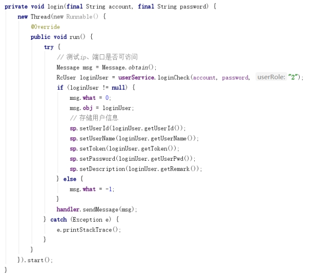 

Handle响应事件处理

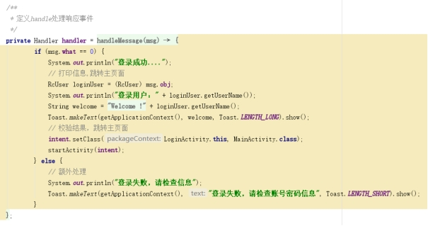 

 

主线程中添加按钮监听事件触发子线程启动

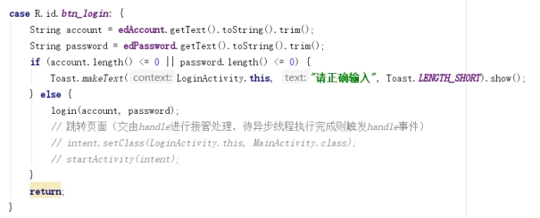 

基于上述步骤，从而构建一个后台接口服务调用的基本步骤

## 3. **RC-后台服务构建说明**

### **系统说明**

​	RC后台管理系统借助idea开发项目模块，采用mysql数据库构建物理存储，并借助Springboot框架相关技术（注解、拦截器/过滤器、数据验证、文件上传等概念），结合Vue、Element-ui相关前端技术栈构建系统UI交互。

系统开发相关的技术构图如下图所示

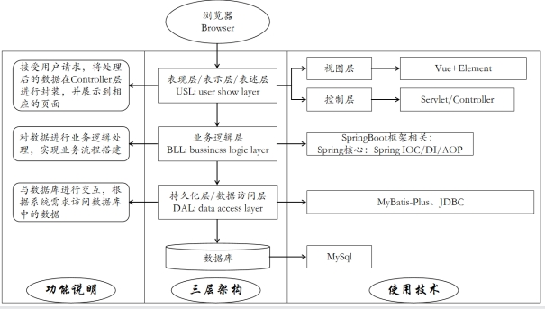 

<center>图-三层架构图</center>

系统功能图如下所示

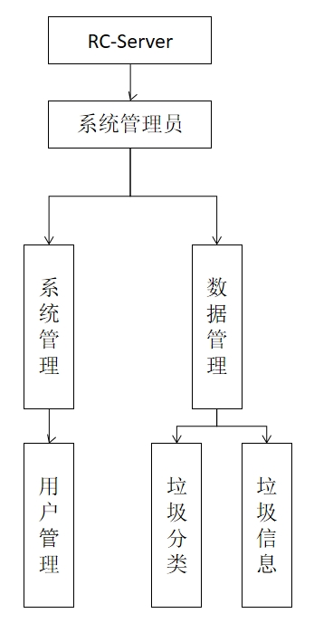 

<center>图-系统功能说明</center>

### **系统实现**

​	后台系统开发采用的是springboot+vue项目的组合，具体工程目录结构说明参考如下所示

#### **<1>后台项目说明**

> 后台项目结构

针对src/main/java下的文件夹进行说明（com.rc.server）

| 文件夹名称          | 开发描述     | 配置文件                                                     |
| ------------------- | ------------ | ------------------------------------------------------------ |
| api                 | 外部接口     | 定义外部接口相关（提供接口供安卓端访问）                     |
|                     |              |                                                              |
| framework/config    | 系统框架相关 | config：存放系统自定义配置 GlobalCorsConfig：跨域配置 MyBatisPlusConfig：mybatis-plus分页插件配置 ShiroConfig：权限校验框架相关配置 |
| framework/domain    | 系统框架相关 | domain：定义一些公共的领域对象                               |
| framework/exception | 系统框架相关 | exception：提供BaseException可扩展自定义异常                 |
| framework/shiro     | 系统框架相关 | shiro：shiro框架相关配置：RBAC角色权限校验控制               |
| framework/utils     | 系统框架相关 | utils：自定义常见的工具类                                    |
|                     |              |                                                              |
| module              | 业务模块相关 | module：业务模块开发（可根据业务需求进行自定义扩展） systemManage：系统管理相关 dataManage：数据管理相关 |

 

后台接口设计系统采用的是MVC架构设计模式，具体业务模块涉及说明如下

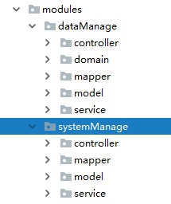 

 

| MVC说明    | 配置文件                                                     |
| ---------- | ------------------------------------------------------------ |
| model      | 实体层定义：主要包括RcUser、Classify、Rubbish                |
| domain     | 领域对象定义：可扩展dto、vo等对象                            |
| mapper     | 持久层定义：用于操作database主要包括UserMapper、ClassifyMapper、RubbishMapper 基于mybatis-plus构建，其对应的映射文件在resources资源文件夹下， |
| service    | 业务逻辑层定义：用于业务逻辑操作控制，调用mapper层 主要包括UserService、ClassifyService、RubbishService、LoginAuthService及其关联的实现类 |
| controller | 控制层定义：用于接收用户交互的数据，调用service层            |

 

#### **<2>前台项目说明**

> VUE前台项目结构说明

前台项目目录说明如下

| 文件夹名称 | 开发描述             | 配置文件                                                     |
| ---------- | -------------------- | ------------------------------------------------------------ |
| assets     | 静态资源存放路径     | 存放css、img等静态资源文件                                   |
| components | 自定义公共组件       | 通用组件定义，根据业务需求自定义扩展公共组件                 |
| mock       | 模拟接口数据         | 统一配置文件：index.js（配置模拟数据开关） 自定义配置文件：modules/xxx.js |
| plugins    | 插件相关配置         | 结合业务需求加载插件                                         |
| router     | 前端路由配置         | 统一配置文件：index.js                                       |
| store      | 缓存配置（vuex相关） | 统一配置文件：index.js 自定义配置文件：modules/xxx.js        |
| utils      | 自定义工具类相关     | 存放枚举、自定义常量、http连接访问配置等相关内容             |
| views      | 模块视图定义         | 结合业务需求自定义页面                                       |

 

前端业务模块开发：

​	vue项目引用的是renren-fast-vue框架，基本内容框架已经封装完成，在原有基础上做自定义调整。如果是加入新的功能模块则相应引入view视图，配置接口访问url已经对应的菜单访问权限控制即可

​	sys-menu.js中控制菜单展示(取消原有后台动态菜单概念，通过前端控制左侧菜单栏展示：navDataList控制)

​	在views中根据业务需求调整模块信息，创建对应的视图进行构建即可，对应业务模块文件说明如下所示

| 模块         | 描述                                                         |
| ------------ | ------------------------------------------------------------ |
| 用户管理     | modules/sys：user.vue、user-add-or-update.vue                |
| 垃圾分类管理 | modules/dataManage：classify.vue、classify-add-or-update.vue |
| 垃圾信息管理 | modules/dataManage：rubbish.vue、rubbish-add-or-update.vue   |

 

## **c.运行结果说明**

### **RC-Android APP**

#### **<1>欢迎页**

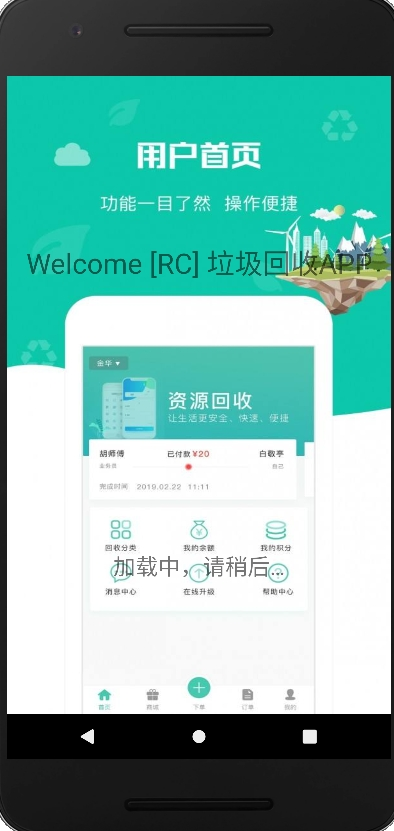 

 

#### **<2>登录注册**

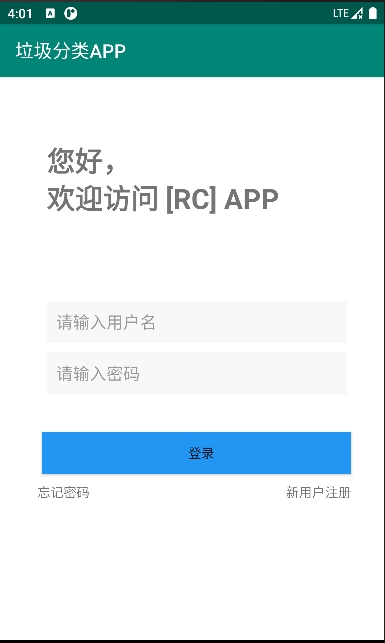 

 

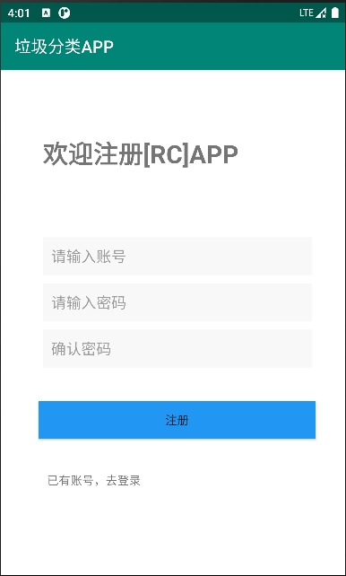 

#### **<3>主界面-首页**

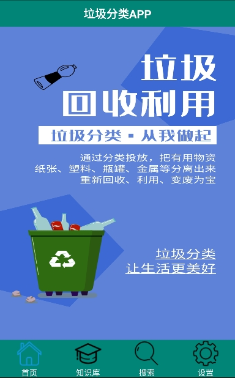 

#### **<4>主界面-知识库**

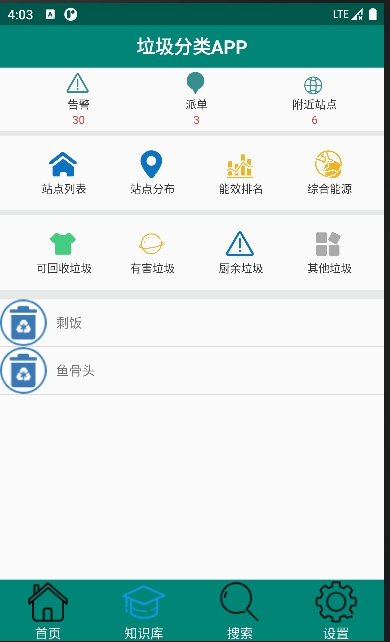 

 

#### **<5>主界面-搜索**

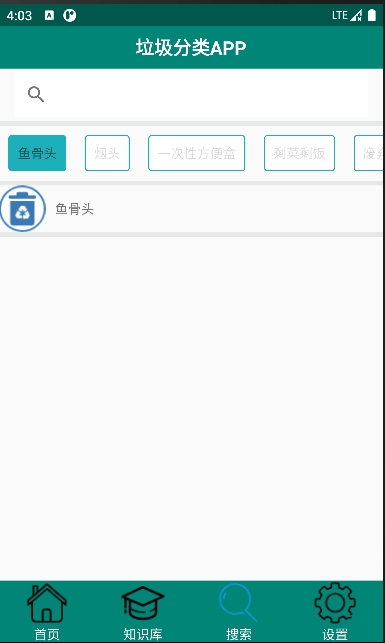 

#### **<6>主界面-设置**

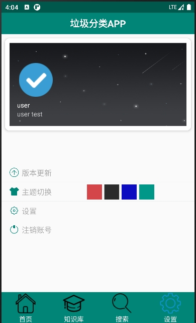 

 

### **RC-Server**

#### **<1>登录**

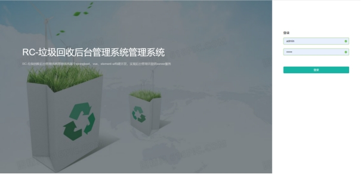 

#### **<2>首页**

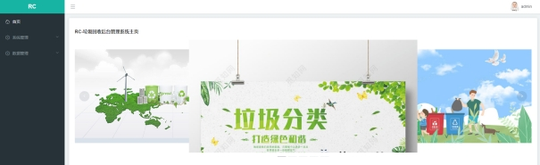 

 

#### **<3>用户管理**

l 用户列表

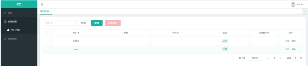 

 

l 编辑用户信息

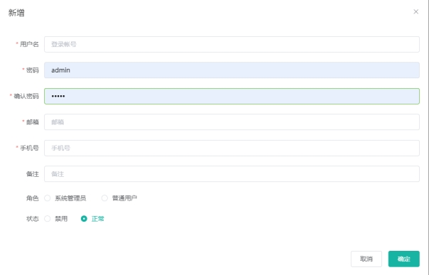 

#### **<4>垃圾分类管理**

> 垃圾分类列表

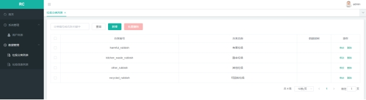 

 

> 垃圾分类信息编辑

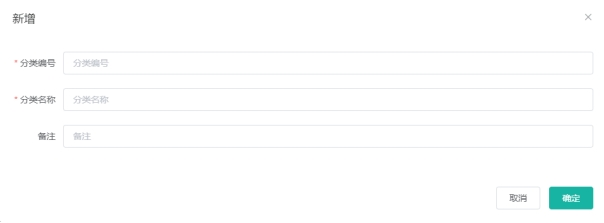 

#### **<5>垃圾信息管理**

> 垃圾信息列表

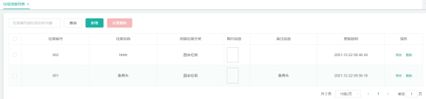 

 

> 垃圾信息编辑

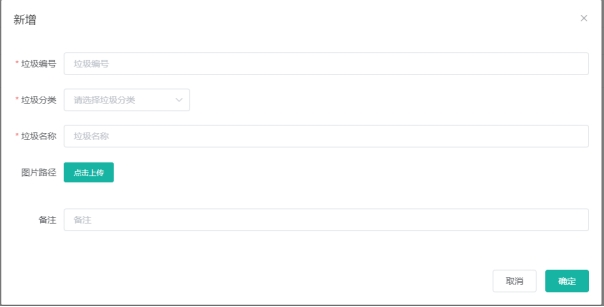 

 

# 系统说明

​	此前主要做WEB端多点，安卓端的应用接触的比较少，也是第一次尝试基于原生构建一个结构相对完善的系统应用，实现的功能比较基础，主要是边学习边探索。比较难的点在于知识点的组合，由多个零零散散的知识点构建系统组成，其中构建过程中遇到问题也会参考网络的资源，但由于涉及的版本不同其相应的解决方案也有所不同，所以走的弯路比较多。如果后续有机会的希望通过一个相对完整的APP系统构建去了解整体项目构建的流程和原理，从而对其流程开发进一步掌握。下述梳理实践开发过程中遇到的问题和相应的解决方案

## **1.常见问题**

### **a.项目环境构建问题**

​	安卓项目构建往往依赖于sdk，在构建新项目的时候有可能会因为一些版本兼容性的问题导致一些代码语法规则的使用限制，甚至可以说是一些常见的开发陷阱，下述简单梳理开发过程中遇到的一些常见的异常和问题排查的思路

#### **<1>lombo**k**插件引入**

​	Lombok 是一种 Java 实用工具，可用来帮助开发人员消除 Java代码的冗长性，在安卓项目中引入lombok插件通过lib文件夹外部链接的方式引入，随后借助gradle进行同步，便可在代码中通过注释的方式处理问题。通过在Project视图下lib文件夹引入依赖的jar，代码编译期间没有问题，但在运行期会相应抛出异常：AndroidStudio3.0 注解报错Annotation processors must be explicitly declared now.

主要是由于Android Studio3.0 annotation processors(注释器)需要显示的去添加，因袭需要在app的build.gradle文件中引入配置

```java
android {
    ...
    defaultConfig {
        ...
        //添加如下配置
        javaCompileOptions { 
					annotationProcessorOptions { includeCompileClasspath = true 
				} 
		}
}
```

 

#### **<2>hutool插件引入**

​	Hutool是一个开源的小而全的Java工具类库,通过静态方法封装,降低相关API的学习成本,提高开发效率。此处项目中引入hutool-core.jar，在项目运行时导入相关依赖，但在构建的时候抛出如下问题，需要调整配置

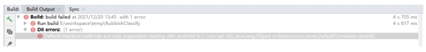 

在app build:gradle中的android配置下添加指定JDK版本的代码：

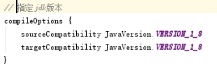 

 

#### **<3>编译环境问题排查**

android编译时出现org.gradle.api.tasks.TaskExecutionException: Execution failed for task ':app:compileDebugJavaWithJavac'.错误

android studio中使用terminal工具。在android studio最下面的底部菜单栏中有（如果没有那cmd中进入项目根目录后）：

(1)windows中使用命令  gradlew compileDebugSource --stacktrace -info

(2)linux/mac中使用 ./gradlew compileDebugSource --stacktrace -info

linux/mac系统中出现 权限不够，请直接在Terminal中 执行 chmod +x gradlew

查看程序中出错的详细信息，进行修改后重新编译。

​	但在项目执行过程中通过重启、清理缓存等方式都不生效，需要查看相应的出错日志去定位问题，通过查阅网络资料发现是环境相关一些版本兼容性问题（AS、JDK、SDK、相关依赖等）

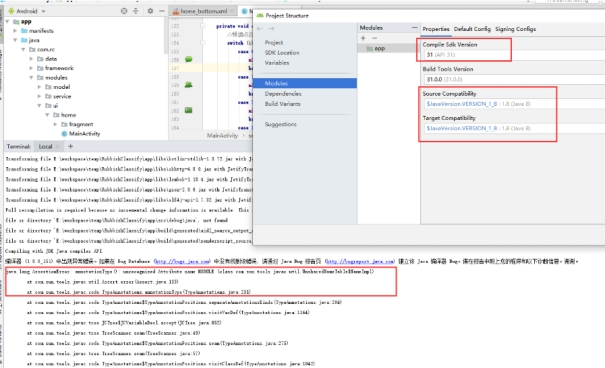 

 

因此通过降低sdk版本到29，问题得以解决

此外较新版的安卓默认使用androidx的包，摒弃了以前的support包。例如在引入ViewPager、CardView等，在引用的时候也要相应注意（虽然编译时不会报错，但在运行时就会抛出相应的ClassNotFindException）

android.support.v4.view.ViewPager对应androidx.viewpager.widget.ViewPager

android.support.v7.widget.CardView对应androidx.cardview.widget.CardView

 

#### **<4>新依赖引入编译错误**

​	在引入新jar相关进来报错：Android Studio Cannot fit requested classes in a single dex file (# methods: 72633 ＞ 65536)（在开发过程中引入了新的组件依赖，导致出现上述问题），参考网上的资源说明，这种问题即收到了Android的64k引用的限制，那什么是64k的引用限制呢？文档：Android 应用 (APK) 文件包含 Dalvik Executable (DEX) 文件形式的可执行字节码文件，这些文件包含用来运行应用的已编译代码。Dalvik Executable 规范将可在单个 DEX 文件内引用的方法总数限制为 65536，其中包括 Android 框架方法、库方法以及您自己的代码中的方法。在计算机科学领域内，术语千（简称 K）表示 1024（即 2^10）。由于 65536 等于 64 X 1024，因此这一限制称为“64K 引用限制”。

​	将minSdkVersion 设为 21 或更高的值，则默认情况下会启用 MultiDex，并且不需要 MultiDex 支持库，或者是在app下的build.gradle中引入multiDex相关配置，具体说明如下：

<1>修改gradle脚本来产生多dex

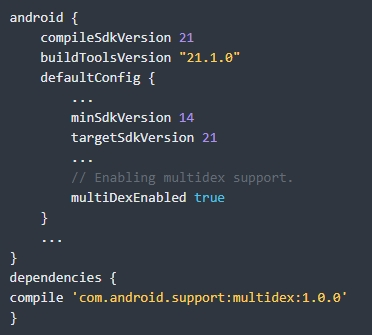 

<2>修改manifest 使用MulitDexApplication

// 正如前面环境问题排查所提到，新版AS取消了support包，而是用androidx作为平替

android:name="android.support.multidex.MultiDexApplication"

android:name="androidx.multidex.MultiDexApplication"

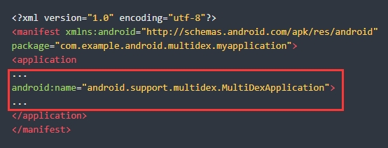 

如果有自定义Application，继承MulitDexApplication。如果当前代码已经继承自其它Application没办法修改，就重写 Application的attachBaseContext()这个方法

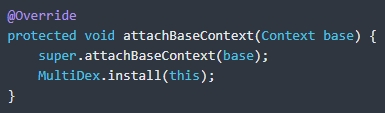 

### **b.数据持久化**

​	数据持久化思路有两个方向，可引入SQLite概念，相当于一个app安装携带着关联的SQLite数据库，但基于这种方式并不是主流app的概念，在互联网时代需要实现数据共享概念，因此引入连接服务器数据库的方式，即通过java的JDBC连接服务器上的数据库或者本地数据库（宿主机），或者重通过http的方式连接服务器上的数据库（可借助中转服务构建）

​	在构建过程中有尝试使用两种方案去构建数据库存储，但基于数据安全性和数据处理便捷性考虑，此处采用借助okhttp3的方式借助中转服务构建数据库存储概念。此外还引用SharePrecefence存储实现用户登录信息的存储。

​	传统的JDBC连接方式则需要引用相关的mysql和jdbc相关依赖，随后借助原生的DB操作完成数据库访问，但此处相应需要注意打通模拟机/实体机与宿主机/云服务的连通性。

此处简单介绍通过中转服务的方式访问数据库，实现步骤说明如下：

<1>创建一个后台服务rc-server，相应提供服务接口供外部调用

<2>app端引入okhttp3相关依赖，随后自定义封装CustomOkHttpUtil提供远程连接的通用操作方法

<3>Activity中调用通过构建子线程的方式调用网络服务

<4>测试是相应检查AndroidManifest.xml文件中是否开启了网络访问权限，虚拟机网络是否开启，宿主机或者服务是否正常开启（检查IP、端口访问连接是否正常）

 

### **c.网络服务访问**

​	Android主线程想要访问网络，则相应需要在AndroidManifest.xml文件中开启网络访问权限，其次需要通过构建子线程的方式去构建网络访问，具体思路参考如下

<1>AndroidManifest.xml文件中开启网络访问权限

```xml
<!-- 添加网络访问权限 -->
<uses-permission android:name="android.permission.INTERNET"/>
```


<2>构建子线程创建网络访问权限

​	不管是是直接连接宿主机的mysql的方式，还是借助中转服务的概念构建服务连接，均需要通过子线程去访问，而避免一些远程连接异常导致主线程的阻塞。具体说明如下所示：

```java
// 1.子线程构建
new Thread(new Runnable() {
    @Override
    public void run() {
        try {
            Message msg = Message.obtain();
// 调用中转服务接口校验用户信息
            RcUser loginUser = userService.loginCheck(account, password, "2");
            // 校验响应数据，随后封装数据通过handle处理响应事件
if (loginUser != null) {
                msg.what = 0;
                msg.obj = loginUser;
                
            } else {
                msg.what = -1;
            }
            handler.sendMessage(msg);
        } catch (Exception e) {
            e.printStackTrace();
        }
    }
}).start();

// 2.自定义handle处理响应事件
private Handler handler = new Handler() {
    @Override
    public void handleMessage(Message msg) {
        if (msg.what == 0) {
            // 响应成功，业务逻辑处理
        } else {
            // 其他响应状态处理
        }
    }
};
```

 

<3>在主线程中添加一些组件触发的事件监听，调用子线程方法进行数据交互

 

#### **网络访问问排查处理**

<1>检查上述步骤是否正常执行

​	一一排查代码，运行时一一排查错误

 

<2>检查安卓模拟机与宿主机/云服务的网络联通行是否正常（IP、端口访问连接测试）

​	可借助工具类测试网络连通性，有些IP访问通了但还是需要相应检查端口访问是否正常

 

<3>检查项目sdk相关版本，排查异常问题。

​	例如项目运行过程中发现，网络连接一直失败（CLEARTEXT communication to * not permitted by network），通过查阅资料发现是sdk版本问题，okhttp3创建连接抛出异常，可以适当降低sdk版本或者通过配置化方式解决：

​	在res目录下新建xml文件夹，文件夹里面创建network_security_config.xml 文件；

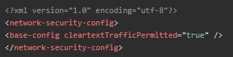 

​	然后在 AndroidManifest.xml 的application 标签加上语句，注册配置即可

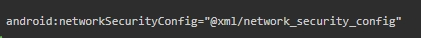 

 

#### d. **数据交互转化**

​	参考现有项目实现通过Gson处理交互数据，因此不管是接收方还是响应方均需对其进行控制，在调用接口的时候发现部分数据源的转换类型异常，从而导致在封装UI组件的时候更新缓存导致类型转换异常，问题的源头主要在于没有正确处理好交互的数据，准确的来说用什么格式转化的数据传送就用什么格式转化接收，如果没有按照这个规则，则可能会出现一些数据没有正常响应或者接收处理的问题，从而触发其他组件的一些联动异常。

​	在项目中更新ListView的时候则遇到类似的问题，通过Gson转化的处理结果`List<Rubbish>`中的子项是以LinkedHashMap的方式存储，而UI更新要求的则是Rubbish对象，从而在切换的时候导致转换异常。

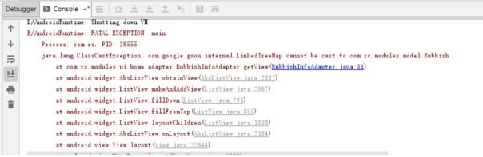 

​	调整转化方式，问题得以解决（此外还需检查数据传送值服务端服务端的处理是否正常，一一排查问题）

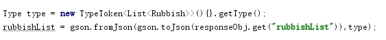 

 

## 2. **项目扩展**

​	目前项目实现了基本的信息查询功能，打通了安卓端、后台服务、数据持久化相关渠道的沟通，通过构建一套相对完善的架构体系进一步掌握移动互联网开发的应用，鉴于时间关系，目前实现的功能比较单一，现有项目还存有很多不足的地方待改善，目前现有项目实现的内容比较基础，都是基于组件应用的知识点拼接和组合，但考虑一个系统的完整性，在后续的学习和应用中应该更好考虑代码的可维护性和功能的迭代性。例如适当引入一些动态配置的概念，从而提升系统的可维护性和功能迭代，而不用每次版本升级都牵一发动全身。

​	考虑功能的扩展性，可以结合实际案例场景引入一些附近站点、定位概念，或者是参考现有app的一些功能实现尝试着去填充功能，但不管是出于何种扩展考虑，都需要相应基础技术栈的支撑，掌握相应组件的应用，随后将其嵌入到项目中。，现有很多渠道和开源项目提供了非常方便的开发脚手架，例如uni-app等。当然，于我而言只是一次基于原生安卓应用的开发探索，因为有时候开发学习往往不拘泥于语言的限制，更重要的是思维的养成~

 

 

 

 

 

 

 

 

 